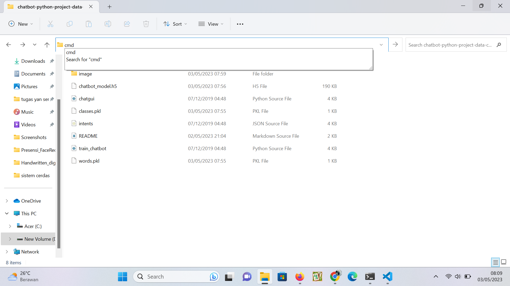
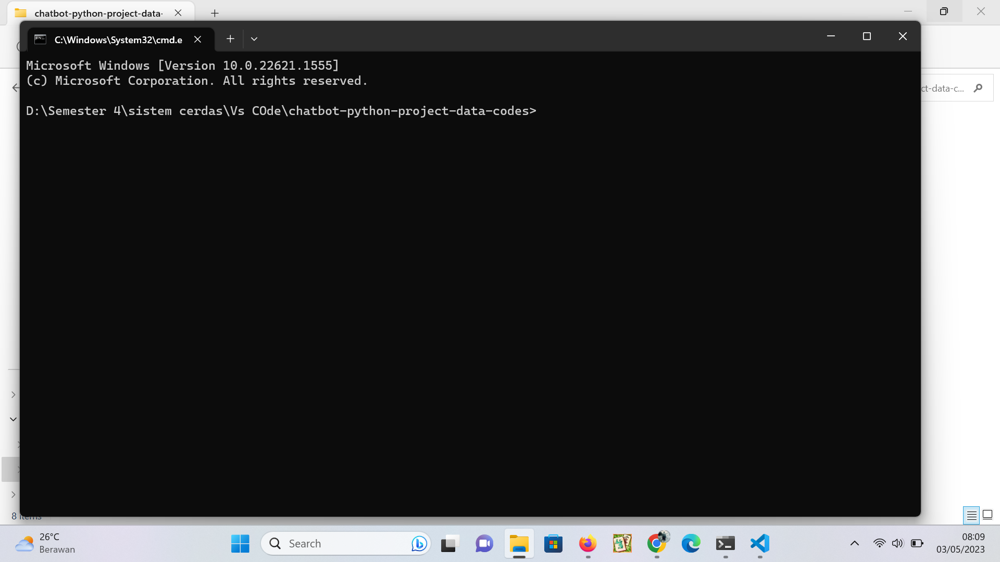
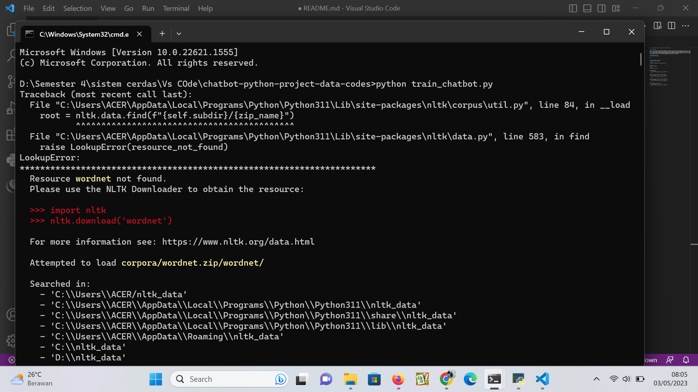
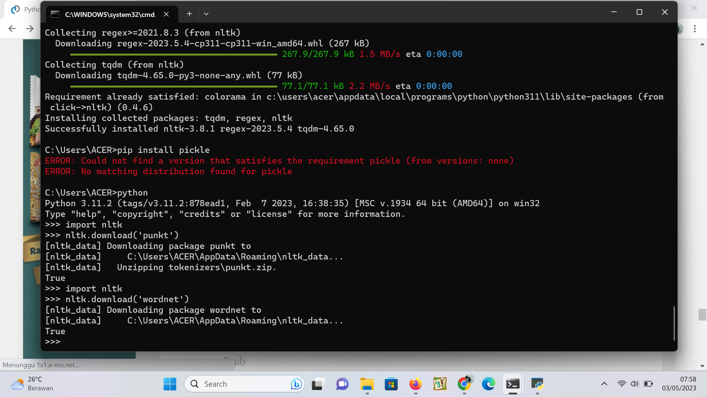
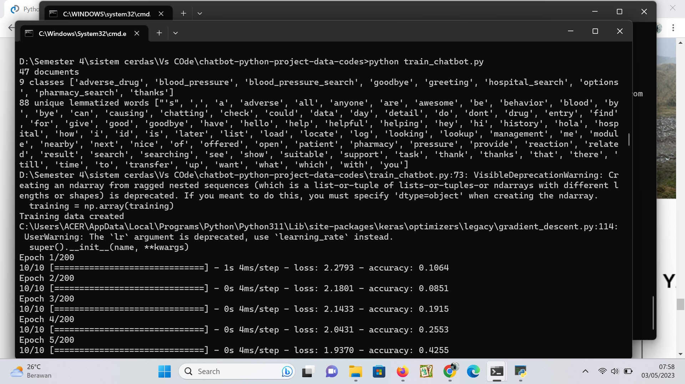
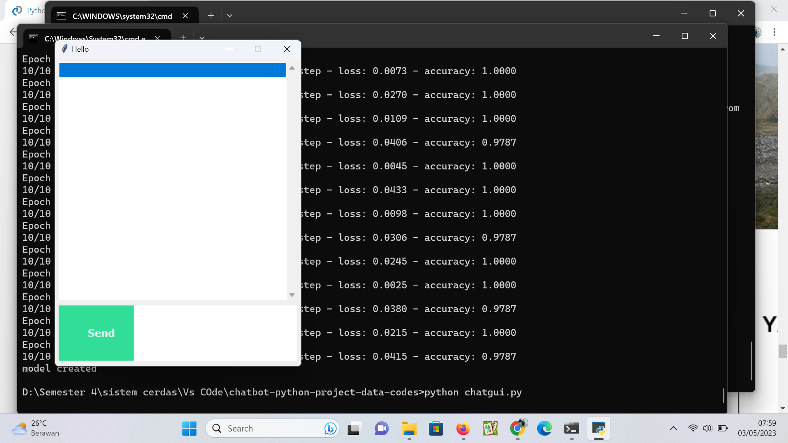
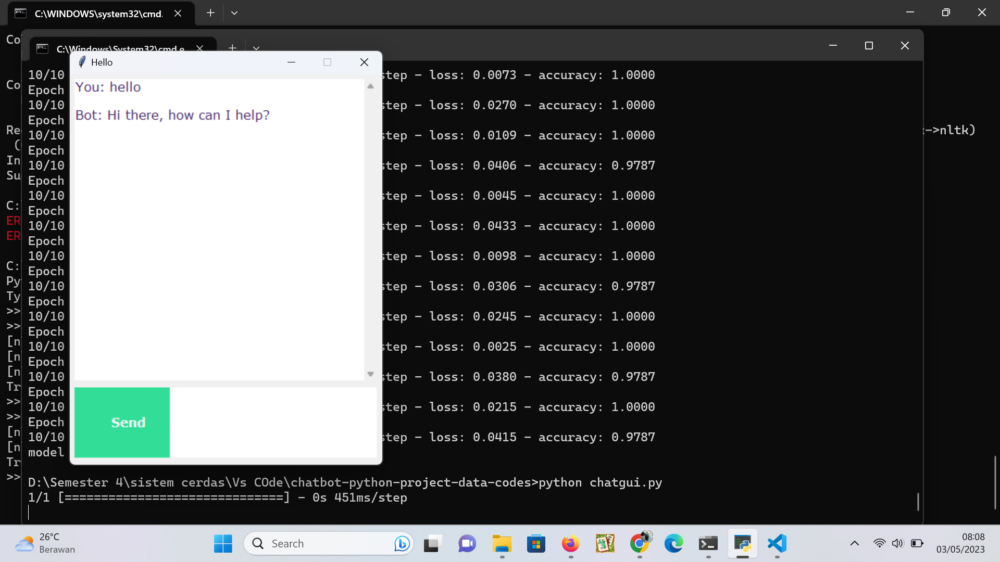

# Tugas Praktikum Sistem Cerdas chatbot using NLTK & Keras

## Latar Belakang

Chatbot atau chatterbot adalah program komputer yang dirancang untuk meniru percakapan manusia melalui aplikasi pesan atau platform obrolan. Chatbot dapat digunakan untuk memberikan informasi, menjawab pertanyaan, melakukan tugas tertentu, atau bahkan sebagai teman virtual untuk pengguna. Chatbot biasanya dijalankan dengan menggunakan teknologi kecerdasan buatan (AI) dan pemrosesan bahasa alami (NLP) untuk memahami dan merespons percakapan pengguna dengan cara yang mirip dengan percakapan antara manusia. Chatbot telah digunakan secara luas di berbagai industri, seperti layanan pelanggan, pemasaran, dan e-commerce.

### Nama Mahasiswa
1. Rafitajudin (21220002)

<br/>
<br/>


## Requirements and installation
To install library, simply:

```bash
> pip install tensorflow, keras, pickle, nltk
```

## Running
manually by running:

```bash
> Python "namafile".py
```

Buka lokasi file kemudian ketik cmd seperti pada gambar dibawah.
<p align="center">
    
    <br>
 </p>

pastikan cmd sudah masuk ke direktori yang dituju.
<p align="center">
    
    <br>
 </p>
 
jika muncul error seperti pada gambar.
<p align="center">
    
    <br>
 </p>

maka lakukan seperti petunjuk error seperti pada gambar.
<p align="center">
    
    <br>
 </p>

kemudian jalankan train_chatbot.
<p align="center">
    
    <br>
 </p>

lalu jalankan chatgui.
<p align="center">
    
    <br>
 </p>

<p align="center">
    
    <br>
 </p>